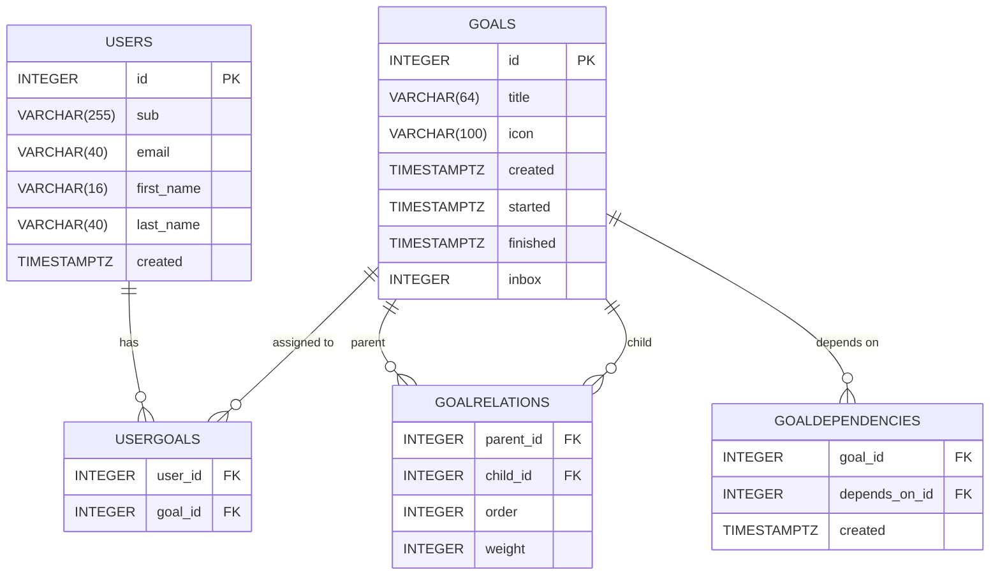

# Plan - Goal Management Application

A goal management and planning application that helps users organize and track
their objectives using a modern web interface with hierarchical goal structures.

## Tech Stack

- **Frontend**: Nuxt 4, TypeScript, Tailwind CSS
- **Backend**: PostgreSQL database
- **Testing**: Vitest, Cucumber.js
- **Deployment**: Kubernetes

## Database Schema

