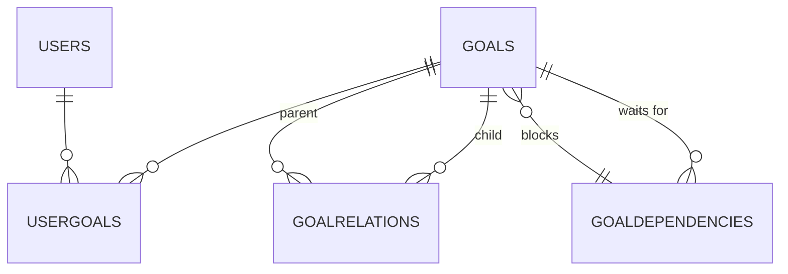

# Plan - Goal Management Application

A goal management and planning application that helps users organize and track
their objectives using a modern web interface with hierarchical goal structures.

## Tech Stack

- **Frontend**: Nuxt 4, TypeScript, Tailwind CSS
- **Backend**: PostgreSQL database
- **Testing**: Vitest, Cucumber.js
- **Deployment**: Kubernetes

## Database Schema

| Table | Column | Type | Constraints |
|-------|--------|------|-------------|
| **users** | id | INTEGER | PK, NOT NULL, UNIQUE |
| | sub | VARCHAR(255) | NOT NULL, UNIQUE |
| | email | VARCHAR(40) | NOT NULL, UNIQUE |
| | first_name | VARCHAR(16) | |
| | last_name | VARCHAR(40) | |
| | created | TIMESTAMPTZ | NOT NULL |
| **goals** | id | INTEGER | PK, NOT NULL, UNIQUE |
| | title | VARCHAR(64) | |
| | icon | VARCHAR(100) | DEFAULT 'heroicons:star' |
| | created | TIMESTAMPTZ | NOT NULL |
| | started | TIMESTAMPTZ | |
| | finished | TIMESTAMPTZ | |
| | inbox | INTEGER | NOT NULL, DEFAULT 1 |
| **user_goals** | user_id | INTEGER | FK → users(id), NOT NULL |
| | goal_id | INTEGER | FK → goals(id), NOT NULL |
| | | | **PK**: (user_id, goal_id) |
| **goal_relations** | parent_id | INTEGER | FK → goals(id), NOT NULL |
| | child_id | INTEGER | FK → goals(id), NOT NULL |
| | order | INTEGER | NOT NULL, DEFAULT 0 |
| | weight | INTEGER | NOT NULL, DEFAULT 10 |
| | | | **PK**: (parent_id, child_id) |
| **goal_dependencies** | goal_id | INTEGER | FK → goals(id), NOT NULL |
| | depends_on_id | INTEGER | FK → goals(id), NOT NULL |
| | created | TIMESTAMPTZ | NOT NULL |
| | | | **PK**: (goal_id, depends_on_id) |
